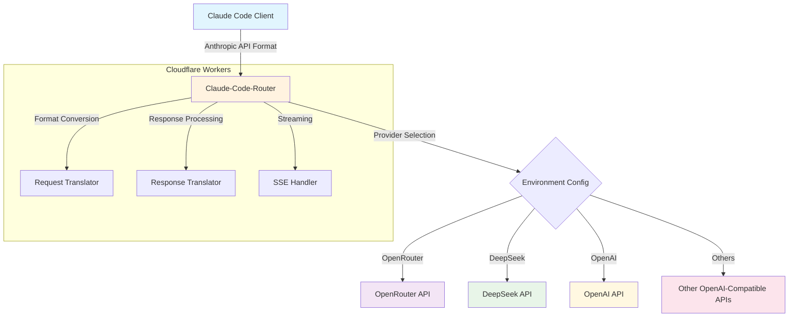
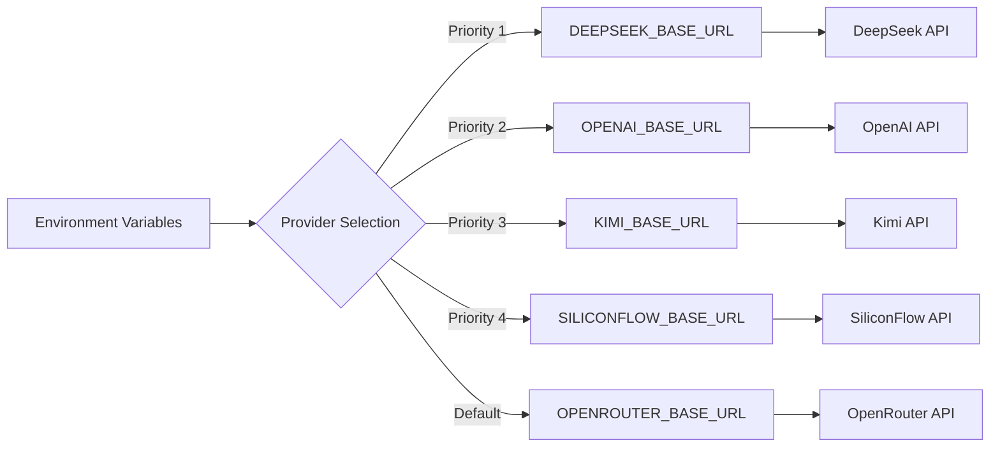

# Claude-Code-Router

Universal API proxy for using Claude Code with multiple AI providers. Seamlessly translates between Anthropic's Claude API and OpenAI-compatible APIs.

## ✨ Features

- **🔄 API Translation**: Anthropic ↔ OpenAI format conversion
- **🌍 Multi-Provider**: OpenRouter, OpenAI, DeepSeek, Kimi, SiliconFlow
- **⚡ Edge Computing**: Cloudflare Workers for global performance
- **📡 Streaming Support**: Real-time response streaming
- **🛡️ Type Safety**: Full TypeScript implementation

## 🚀 Quick Start

### 1. Install Claude Code
```bash
npm install -g @anthropic-ai/claude-code
```

### 2. Configure API Access
```bash
# Option A: Use shared instance (testing only)
export ANTHROPIC_BASE_URL="https://cc.xiaohui.cool"
export ANTHROPIC_API_KEY="your-provider-api-key"

# Option B: Deploy your own instance (recommended)
git clone https://github.com/your-username/claude-code-router
cd claude-code-router && wrangler deploy
export ANTHROPIC_BASE_URL="https://your-domain.workers.dev"
```

### 3. Start Using Claude Code
```bash
source ~/.bashrc && claude
```

### Provider Setup

| Provider | API Key Source | Base URL |
|----------|----------------|----------|
| OpenRouter | [openrouter.ai](https://openrouter.ai) | `https://cc.xiaohui.cool` |
| DeepSeek | [platform.deepseek.com](https://platform.deepseek.com) | Deploy with `DEEPSEEK_BASE_URL` |
| OpenAI | [platform.openai.com](https://platform.openai.com) | Deploy with `OPENAI_BASE_URL` |


## 🏗️ Architecture



## ⚡ Technical Stack

### Core Runtime
- **Platform**: Cloudflare Workers (V8 Isolates)
- **Language**: TypeScript with strict typing
- **Runtime**: Edge-optimized JavaScript (no Node.js dependencies)
- **Deployment**: Wrangler CLI + GitHub Actions

### Architecture Patterns
| Pattern | Implementation | Benefit |
|---------|----------------|----------|
| **Edge Computing** | 300+ global locations | <1ms cold start, 0ms warm start |
| **Serverless** | Auto-scaling isolates | 0 maintenance, infinite scale |
| **Type Safety** | Full TypeScript coverage | Runtime error prevention |
| **Streaming** | Web Streams API | Real-time response delivery |
| **Modular Design** | Functional composition | Easy testing & maintenance |

### Build System
- **Bundler**: esbuild (10x faster than webpack)
- **Module System**: ES6 with tree-shaking
- **Asset Pipeline**: TypeScript → JavaScript + type checking
- **Hot Reload**: Wrangler dev server with instant updates


## 🔧 Deployment

### Development
```bash
git clone https://github.com/your-username/claude-code-router
cd claude-code-router
npm install && npm install -g wrangler
npm run dev    # Start development server
```

### Production Deployment
```bash
# Configure environment variables
wrangler secret put OPENROUTER_BASE_URL       # OpenRouter backend
wrangler secret put DEEPSEEK_BASE_URL         # DeepSeek backend  
wrangler secret put OPENAI_BASE_URL           # OpenAI backend

# Deploy to Cloudflare Workers
npm run deploy
```

### Environment Configuration



## 🔌 API Reference

### Request Format (Anthropic)
```bash
curl -X POST https://cc.xiaohui.cool/v1/messages \
  -H "Content-Type: application/json" \
  -H "x-api-key: your-api-key" \
  -d '{
    "model": "claude-3-5-sonnet-20241022",
    "messages": [{"role": "user", "content": "Hello"}],
    "max_tokens": 100,
    "stream": true
  }'
```

### Model Mapping
| Claude Model | OpenRouter | DeepSeek | OpenAI |
|--------------|------------|----------|---------|
| `claude-3-5-haiku-20241022` | `anthropic/claude-3.5-haiku` | `deepseek-chat` | `gpt-4o-mini` |
| `claude-3-5-sonnet-20241022` | `anthropic/claude-3.5-sonnet` | `deepseek-chat` | `gpt-4o` |
| `claude-3-opus-20240229` | `anthropic/claude-3-opus` | `deepseek-reasoner` | `gpt-4o` |

## 📁 Architecture & Structure

### Worker Runtime Architecture
```
┌─────────────────────────────────────────────────────────────────┐
│                        Cloudflare Workers                        │
├─────────────────────────────────────────────────────────────────┤
│ 🔄 Request Router    │ 🔄 Format Converter │ 📡 Stream Handler  │
│ • Path matching       │ • Anthropic → OpenAI  │ • SSE processing    │
│ • Method validation   │ • OpenAI → Anthropic  │ • Chunk buffering   │
│ • Auth handling       │ • Model mapping      │ • Error recovery    │
└─────────────────────────────────────────────────────────────────┘
```

### File Structure
```
claude-code-router/
├── 📁 src/
│   ├── 📁 client/              # Frontend & documentation system
│   │   └── 📁 bestPractices/    # Markdown-based docs with TypeScript
│   └── 📁 server/              # Worker runtime logic
├── 📁 shared/                  # Cross-platform utilities
│   ├── 📁 components/          # Reusable UI components
│   └── 📁 utils/               # Helper functions
├── 📁 modules/                 # Static HTML templates
├── 📁 scripts/                 # Build automation
├── 🔧 index.ts                 # Worker entry point (fetch handler)
├── 🔧 formatRequest.ts         # Anthropic → OpenAI transformer
├── 🔧 formatResponse.ts        # OpenAI → Anthropic transformer
├── 🔧 streamResponse.ts        # Server-Sent Events handler
├── 🔧 types.ts                 # TypeScript definitions
└── ⚙️ wrangler.toml            # Worker configuration & bindings
```

### Key Design Principles
- **🌐 Edge-First**: Optimized for Cloudflare's global network
- **🔒 Zero Dependencies**: No external runtime dependencies
- **⚡ Performance**: Sub-millisecond response times
- **🔄 Streaming**: Native Web Streams API support
- **🛡️ Type Safety**: Full TypeScript coverage with strict mode

## 🙏 Acknowledgments

Built with inspiration from:
- [claude-code-router](https://github.com/musistudio/claude-code-router)
- [claude-code-proxy](https://github.com/kiyo-e/claude-code-proxy)

## ⚖️ License & Disclaimer

**MIT License** - Use at your own risk and discretion.

⚠️ **Important**: This is an independent tool, not affiliated with Anthropic, OpenAI, or OpenRouter. Users are responsible for compliance with all relevant Terms of Service and API usage policies.