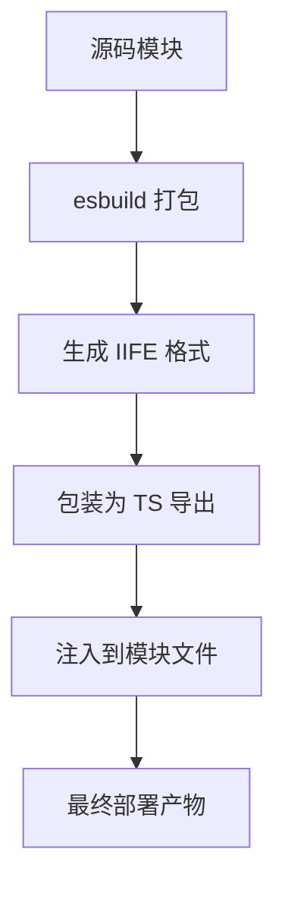

# Claude Code Router 综合开发指南

## 概述

本文档融合了客户端-服务端架构、构建系统设计和模块化开发的精华内容，为 Claude Code Router 项目提供全面的开发指导原则和最佳实践。

## 核心架构原则

### 1. 环境适配原则

**问题背景**: Cloudflare Workers 环境缺少 DOM API，传统客户端代码无法直接执行。

**解决方案**: 职责分离架构
```
┌─────────────────┐    ┌─────────────────┐
│   Worker 端     │    │    客户端       │
├─────────────────┤    ├─────────────────┤
│ • 静态 HTML     │    │ • DOM 操作      │
│ • 数据处理      │    │ • 事件处理      │
│ • 模板渲染      │    │ • 动态更新      │
│ • 路由处理      │    │ • 用户交互      │
└─────────────────┘    └─────────────────┘
```

### 2. 模块化设计原则

#### 单一职责原则
```typescript
// ✅ 职责明确的模块
export const getStartedModule = `
<section class="content-section" id="get-started">
    ${setupComponent}
    ${deploymentComponent}
</section>
`;

// ❌ 职责混乱的模块
export const mixedModule = `
    ${setupComponent}${aboutComponent}${contactComponent}
`;
```

#### 高内聚低耦合
```typescript
// ✅ 高内聚：相关组件组织在一起
modules/get-started/components/
├── setup.ts          # 设置组件
├── providers.ts      # 供应商组件
└── deployment.ts     # 部署组件

// ✅ 低耦合：通过接口交互
import { Provider } from '../types/provider';
```

### 3. 类型安全原则

```typescript
// 定义完整的类型层次
export interface Provider extends BaseEntity {
  id: string;
  displayName: string;
  isDirectlyUsable: boolean;
  features: string[];
  specialConfig?: SpecialConfig;
}

// 使用类型守卫验证数据
export function isProvider(obj: any): obj is Provider {
  return typeof obj === 'object' && 
         typeof obj.id === 'string' &&
         typeof obj.isDirectlyUsable === 'boolean';
}
```

## 构建系统架构

### 核心构建流程



### 构建配置策略

```javascript
// 通用 esbuild 配置
const commonConfig = {
  bundle: true,
  format: 'iife',
  target: 'es2020',
  platform: 'browser',
  minify: false,  // 开发时便于调试
  write: false,   // 需要后处理
  loader: {
    '.md': 'text'  // Markdown 文件支持
  }
};

// 主构建控制器
async function buildClientScripts() {
  try {
    await buildBestPracticesModule();
    await buildProviderDetailsModule();
    await injectClientScripts();
    console.log('✅ 构建完成');
  } catch (error) {
    console.error('❌ 构建失败:', error);
    process.exit(1);
  }
}
```

### 脚本注入机制

```javascript
// 占位符替换策略
async function injectClientScripts() {
  const bundleContent = fs.readFileSync(bundleFile, 'utf8');
  const scriptMatch = bundleContent.match(/export const \w+ = \"(.+)\";/);
  const scriptContent = JSON.parse(`\"${scriptMatch[1]}\"`);
  
  let moduleContent = fs.readFileSync(targetFile, 'utf8');
  moduleContent = moduleContent.replace(
    '// SCRIPT_PLACEHOLDER', 
    scriptContent
  );
  
  fs.writeFileSync(targetFile, moduleContent, 'utf8');
}
```

## 组件开发模式

### 1. 模板组件模式

```typescript
// Worker 端：静态内容生成
function generateProviderCard(provider: Provider): string {
  const statusBadges = getStatusBadge(provider.isDirectlyUsable);
  const iconStyle = getProviderColor(provider);
  
  return `
    <div class="provider-card" 
         data-provider="${escapeHtml(provider.id)}"
         onclick="showProviderDetails('${escapeHtml(provider.id)}')">
      <div class="provider-header">
        <span class="provider-icon" style="background: ${iconStyle}">
          ${escapeHtml(provider.icon)}
        </span>
        <h4>${escapeHtml(provider.displayName)}</h4>
      </div>
      <p>${escapeHtml(provider.description)}</p>
    </div>
  `;
}
```

### 2. 客户端交互模式

```typescript
// 客户端：DOM 操作和事件处理
export function showProviderDetails(providerId: string): void {
  const provider = providers.find(p => p.id === providerId);
  if (!provider) {
    console.warn(`Provider ${providerId} not found`);
    return;
  }
  
  const detailsElement = document.getElementById('provider-details');
  const contentElement = document.getElementById('details-content');
  
  if (!detailsElement || !contentElement) {
    console.error('Required DOM elements not found');
    return;
  }
  
  // 安全的 DOM 操作
  contentElement.innerHTML = '';
  const detailsContent = generateProviderDetailsContent(provider);
  contentElement.appendChild(detailsContent);
  
  detailsElement.style.display = 'block';
  detailsElement.scrollIntoView({ behavior: 'smooth' });
}
```

## 代码组织策略

### 文件结构规范

```
claude-code-router/
├── modules/                    # 功能模块
│   ├── get-started/           # 快速开始
│   │   ├── components/        # 组件
│   │   ├── types/            # 类型定义
│   │   └── index.ts          # 模块入口
│   └── best-practices/        # 最佳实践
├── shared/                    # 共享资源
│   ├── scripts/              # 客户端脚本
│   │   ├── generated/        # 构建产物
│   │   └── *.ts             # 源码脚本
│   ├── styles/               # 样式文件
│   └── utils/                # 工具函数
└── src/client/               # 客户端源码
    └── bestPractices/        # 模块化源码
```

### 导入导出规范

```typescript
// ✅ 明确的模块导出
// modules/get-started/index.ts
export const getStartedModule = `...`;
export * from './components/setup';
export * from './types/provider';

// ✅ 类型优先导出
// types/provider.ts
export interface Provider { ... }
export const providers: Provider[] = [...];

// ✅ 集中管理工具函数
// shared/utils/index.ts
export { escapeHtml } from './security';
export { debounce } from './performance';
```

## 样式系统设计

### CSS 变量系统

```typescript
export const baseStyles = `
:root {
  --color-primary: #2563eb;
  --color-secondary: #64748b;
  --color-accent: #7c3aed;
  --color-bg-primary: #ffffff;
  --color-bg-secondary: #f8fafc;
  --color-text-primary: #1e293b;
  --color-text-secondary: #64748b;
  --color-border-light: #e2e8f0;
}
`;
```

### 响应式设计模式

```typescript
export const responsiveStyles = `
.provider-grid {
  display: grid;
  grid-template-columns: 1fr;
  gap: 1rem;
}

@media (min-width: 768px) {
  .provider-grid {
    grid-template-columns: repeat(2, 1fr);
  }
}

@media (min-width: 1024px) {
  .provider-grid {
    grid-template-columns: repeat(3, 1fr);
  }
}
`;
```

### 类型安全验证

```typescript
// 运行时类型验证
export function validateProviders(providers: any[]): Provider[] {
  return providers.filter(isProvider);
}

// 错误边界处理
export function safeExecute<T>(
  fn: () => T, 
  fallback: T, 
  errorMessage?: string
): T {
  try {
    return fn();
  } catch (error) {
    console.error(errorMessage || 'Execution failed:', error);
    return fallback;
  }
}
```

## 性能优化策略

### 构建优化

```javascript
// Tree Shaking 配置
const optimizedConfig = {
  ...commonConfig,
  treeShaking: true,
  sideEffects: false,
  define: {
    'process.env.NODE_ENV': '"production"'
  }
};

// 代码分割
const moduleMap = {
  'get-started': () => import('./modules/get-started'),
  'best-practices': () => import('./modules/best-practices')
};
```

### 缓存策略

```typescript
class ModuleCache {
  private cache = new Map<string, any>();
  
  get<T>(key: string): T | undefined {
    return this.cache.get(key);
  }
  
  set<T>(key: string, value: T): void {
    this.cache.set(key, value);
  }
}

// 使用缓存
const moduleCache = new ModuleCache();
function getCachedComponent(id: string): string {
  if (moduleCache.has(id)) {
    return moduleCache.get(id);
  }
  
  const component = generateComponent(id);
  moduleCache.set(id, component);
  return component;
}
```


## 扩展指南

### 添加新模块

1. **创建模块结构**
```
modules/new-module/
├── components/
├── types/
└── index.ts
```

2. **更新构建脚本**
```javascript
async function buildNewModule() {
  const config = {
    ...commonConfig,
    entryPoints: ['src/client/newModule/index.ts']
  };
  
  const result = await esbuild.build(config);
  // 处理构建结果...
}
```

3. **添加到主构建流程**
```javascript
async function buildClientScripts() {
  await buildBestPracticesModule();
  await buildProviderDetailsModule();
  await buildNewModule();  // 新模块
  await injectClientScripts();
}
```

## 关键成功因素

### 1. 架构设计
- ✅ 环境适配：解决 Workers DOM 限制
- ✅ 职责分离：Worker 静态内容 + 客户端交互
- ✅ 模块化：清晰的组件边界和接口

### 2. 构建系统
- ✅ 自动化：完整的构建和注入流程
- ✅ 类型安全：TypeScript 全程支持
- ✅ 性能优化：Tree Shaking 和代码压缩
