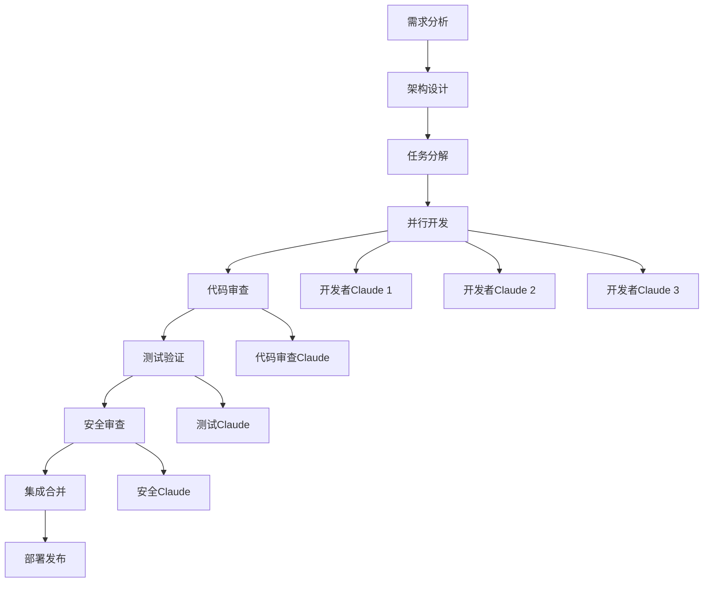

# 多 Claude 并发干活 - 构建高效的 AI 协作开发团队

> 状态：已完成
> 分类：并发协作
> 更新时间：2025-01-19

## 概述

通过多个 Claude Code 实例的并发协作，我们可以构建一个高效的 AI 开发团队。每个 Claude 承担不同的角色和职责，实现真正的并行开发。这种模式特别适合大型项目、复杂功能开发和需要多角度审查的场景。

## 核心理念

### AI 团队协作模式

将传统的开发团队角色映射到多个 Claude 实例：

- **架构师 Claude**：负责系统设计和技术决策
- **开发者 Claude**：负责功能实现和代码编写  
- **测试工程师 Claude**：负责测试设计和质量保证
- **审查者 Claude**：负责代码审查和最佳实践检查
- **运维 Claude**：负责部署、监控和故障排除

### 隔离和协作平衡

- **环境隔离**：每个 Claude 在独立的工作环境中运行
- **信息共享**：通过 Git、文档和约定进行信息同步
- **角色专业化**：每个 Claude 专注于特定领域的任务
- **协作机制**：建立清晰的协作流程和通信规范

## Git Worktrees 并行开发策略

### 基础 Worktree 管理

Git Worktrees 是实现环境隔离的核心技术：

```bash
# 查看当前工作区状态
git worktree list

# 基于当前分支创建功能开发工作区
git worktree add -b feature/user-auth ../project-auth main
git worktree add -b feature/payment ../project-payment main
git worktree add -b feature/admin-panel ../project-admin main

# 创建专用的测试和审查工作区
git worktree add -b testing/integration ../project-testing main
git worktree add -b review/code-quality ../project-review main
```

### 高级 Worktree 配置

```bash
#!/bin/bash
# setup-parallel-dev.sh - 并行开发环境设置脚本

PROJECT_NAME=$(basename $(pwd))
BASE_DIR=$(dirname $(pwd))

# 功能开发工作区
FEATURES=(
    "user-management"
    "payment-system" 
    "notification-service"
    "admin-dashboard"
    "api-gateway"
)

# 支持工作区
SUPPORT_AREAS=(
    "testing"
    "documentation" 
    "performance"
    "security"
    "deployment"
)

echo "🚀 设置并行开发环境..."

# 创建功能开发工作区
for feature in "${FEATURES[@]}"; do
    WORKTREE_PATH="$BASE_DIR/$PROJECT_NAME-$feature"
    
    echo "📁 创建工作区: $feature"
    git worktree add -b "feature/$feature" "$WORKTREE_PATH" main
    
    # 在工作区中安装依赖
    cd "$WORKTREE_PATH"
    npm install > /dev/null 2>&1 || echo "⚠️  依赖安装失败: $feature"
    
    # 创建专用配置
    cat > .claude/config.json <<EOF
{
  "role": "developer",
  "focus": "$feature",
  "allowedTools": ["Edit", "Read", "Bash", "Write"],
  "constraints": {
    "modifyOnlyPath": "src/$feature/",
    "testRequired": true,
    "docRequired": true
  }
}
EOF

    echo "✅ 工作区就绪: $feature"
    cd - > /dev/null
done

# 创建支持工作区
for area in "${SUPPORT_AREAS[@]}"; do
    WORKTREE_PATH="$BASE_DIR/$PROJECT_NAME-$area"
    
    echo "🔧 创建支持工作区: $area"
    git worktree add -b "support/$area" "$WORKTREE_PATH" main
    
    cd "$WORKTREE_PATH"
    npm install > /dev/null 2>&1
    
    # 根据不同角色配置不同的工具权限
    case $area in
        "testing")
            ALLOWED_TOOLS='["Read", "Write", "Bash", "Edit"]'
            FOCUS="测试设计、自动化测试、质量保证"
            ;;
        "documentation")
            ALLOWED_TOOLS='["Read", "Write", "Edit", "WebFetch"]'
            FOCUS="文档编写、API文档、用户指南"
            ;;
        "performance")
            ALLOWED_TOOLS='["Read", "Bash", "Edit"]'
            FOCUS="性能分析、优化建议、监控配置"
            ;;
        "security")
            ALLOWED_TOOLS='["Read", "Bash", "Write"]'
            FOCUS="安全审计、漏洞扫描、安全加固"
            ;;
        "deployment")
            ALLOWED_TOOLS='["Read", "Bash", "Write", "Edit"]'
            FOCUS="CI/CD配置、部署脚本、运维监控"
            ;;
    esac
    
    cat > .claude/config.json <<EOF
{
  "role": "$area",
  "focus": "$FOCUS",
  "allowedTools": $ALLOWED_TOOLS,
  "constraints": {
    "readOnlyMode": false,
    "requireApproval": true
  }
}
EOF

    echo "✅ 支持工作区就绪: $area"
    cd - > /dev/null
done

echo "🎉 并行开发环境设置完成！"
echo ""
echo "📋 工作区列表："
git worktree list
echo ""
echo "🔧 启动 Claude 实例："
echo "cd $BASE_DIR/$PROJECT_NAME-user-management && claude"
echo "cd $BASE_DIR/$PROJECT_NAME-testing && claude"
echo "cd $BASE_DIR/$PROJECT_NAME-security && claude"
```

## 代码审查协作模式

### 双 Claude 审查系统

#### 主要开发者 (Developer Claude)

```bash
# 终端 1：主要开发工作
cd project-main
claude

# 开发者 Claude 的角色设定
"你是主要开发者，专注于功能实现：

职责：
1. 理解业务需求并设计技术方案
2. 编写高质量的代码实现
3. 确保代码符合项目规范
4. 编写基础的单元测试
5. 及时响应审查意见

工作原则：
- 遵循 TDD 开发流程
- 优先考虑代码可读性和可维护性
- 定期提交小粒度的变更
- 主动寻求代码审查

当前任务：实现用户注册功能，包括邮箱验证和密码强度检查。"
```

#### 代码审查者 (Reviewer Claude)  

```bash
# 终端 2：代码审查工作
cd project-review  # 相同代码库的另一个工作区
claude

# 审查者 Claude 的角色设定
"你是资深代码审查者，专注于代码质量：

职责：
1. 审查代码的正确性和安全性
2. 检查是否遵循最佳实践
3. 评估代码的性能和可扩展性
4. 验证测试覆盖率和质量
5. 提供建设性的改进建议

审查清单：
- [ ] 业务逻辑正确性
- [ ] 代码安全性（输入验证、权限检查）
- [ ] 性能考虑（算法复杂度、数据库查询）
- [ ] 测试完整性（单元测试、集成测试）
- [ ] 文档完整性（注释、API文档）
- [ ] 错误处理充分性

请审查刚刚实现的用户注册功能。"
```

### 三方审查协作

添加第三个专业化审查角色：

#### 安全审查者 (Security Claude)

```bash
# 终端 3：安全审查
cd project-security
claude

"你是安全专家，专门进行安全审查：

安全审查重点：
1. **输入验证**：
   - SQL注入防护
   - XSS攻击防护  
   - CSRF保护机制
   
2. **认证授权**：
   - 密码存储安全（bcrypt哈希）
   - 会话管理安全
   - 权限验证完整性
   
3. **数据保护**：
   - 敏感数据加密
   - 数据传输安全（HTTPS）
   - 日志敏感信息过滤
   
4. **漏洞检查**：
   - 依赖包安全漏洞
   - 配置安全问题
   - 业务逻辑漏洞

请对用户注册功能进行安全审查。"
```

## 专业化角色分工

### 架构师 Claude

```bash
# 系统架构设计和技术决策
cd project-architecture
claude

"你是系统架构师，负责高层设计：

核心职责：
1. **系统设计**：
   - 微服务架构规划
   - 数据库设计和优化
   - API设计和版本管理
   
2. **技术选型**：
   - 评估技术方案的优缺点
   - 制定技术标准和规范
   - 解决技术难题和瓶颈
   
3. **质量把控**：
   - 代码架构审查
   - 性能和扩展性评估
   - 技术风险识别和缓解

当前项目：电商平台微服务化改造
请设计用户服务的架构方案。"
```

### 测试工程师 Claude

```bash
cd project-testing  
claude

"你是专业测试工程师，负责质量保证：

测试职责：
1. **测试策略制定**：
   - 单元测试策略（目标覆盖率80%+）
   - 集成测试方案
   - E2E测试场景设计
   
2. **自动化测试**：
   - Jest/Vitest 单元测试
   - Cypress/Playwright E2E测试
   - API 接口测试
   
3. **质量监控**：
   - 测试覆盖率监控
   - 性能测试和基准测试
   - 回归测试自动化

4. **缺陷管理**：
   - Bug报告和跟踪
   - 测试报告生成
   - 质量度量分析

请为用户注册功能设计完整的测试方案。"
```

### DevOps 工程师 Claude

```bash
cd project-devops
claude

"你是 DevOps 工程师，负责运维和自动化：

运维职责：
1. **CI/CD 管道**：
   - GitHub Actions 工作流设计
   - 自动化测试集成
   - 部署流水线优化
   
2. **基础设施**：
   - Docker 容器化配置
   - Kubernetes 部署配置
   - 监控和日志系统
   
3. **运维自动化**：
   - 自动化部署脚本
   - 备份和恢复策略
   - 故障自动恢复
   
4. **安全运营**：
   - 密钥管理
   - 网络安全配置
   - 合规性检查

请设计用户服务的完整部署方案。"
```

## 协作流程和同步机制

### 标准协作流程



### 同步机制设计

#### 1. Git 分支策略

```bash
# 主分支保护
main                    # 生产分支，受保护
├── develop            # 开发集成分支
├── feature/user-auth  # 功能分支（开发者Claude 1）
├── feature/payment    # 功能分支（开发者Claude 2）
├── feature/admin      # 功能分支（开发者Claude 3）
├── testing/integration # 测试分支（测试Claude）
└── security/audit     # 安全审查分支（安全Claude）
```

#### 2. 通信协议

```markdown
# 协作通信模板

## 开发者 -> 审查者
标题：[REVIEW] 功能名称 - 简短描述
内容：
- 📋 功能描述：实现了什么
- 🔧 技术方案：使用的技术和方法
- ✅ 自测结果：本地测试情况
- ❓ 关注点：希望重点审查的地方
- 📁 文件变更：主要修改的文件

## 审查者 -> 开发者  
标题：[FEEDBACK] 功能名称 - 审查结果
内容：
- ✅ 通过项：符合标准的地方
- ⚠️  改进建议：可以优化的地方
- ❌ 必修项：必须修复的问题
- 📚 参考资料：相关的最佳实践链接
- 🔄 下一步：后续动作建议
```

#### 3. 状态同步脚本

```bash
#!/bin/bash
# sync-team-status.sh - 团队状态同步脚本

PROJECT_BASE="$(dirname $(pwd))"
PROJECTS=(
    "project-main:开发主线"
    "project-testing:测试工作"  
    "project-security:安全审查"
    "project-devops:运维部署"
)

echo "📊 团队协作状态同步报告"
echo "================================"
echo "生成时间: $(date)"
echo ""

for project_info in "${PROJECTS[@]}"; do
    IFS=':' read -r project_dir project_desc <<< "$project_info"
    project_path="$PROJECT_BASE/$project_dir"
    
    if [ -d "$project_path" ]; then
        echo "🔧 $project_desc ($project_dir)"
        echo "   分支: $(cd "$project_path" && git branch --show-current)"
        echo "   最新提交: $(cd "$project_path" && git log -1 --oneline)"
        echo "   工作状态: $(cd "$project_path" && git status --porcelain | wc -l) 个未提交变更"
        echo ""
    fi
done

# 生成合并冲突检查
echo "🔍 潜在合并冲突检查"
echo "--------------------------------"
cd "$PROJECT_BASE/project-main"
for project_info in "${PROJECTS[@]}"; do
    IFS=':' read -r project_dir project_desc <<< "$project_info"
    if [ "$project_dir" != "project-main" ]; then
        project_path="$PROJECT_BASE/$project_dir"
        if [ -d "$project_path" ]; then
            branch_name=$(cd "$project_path" && git branch --show-current)
            echo "检查 $project_desc ($branch_name):"
            git merge-tree $(git merge-base main $branch_name) main $branch_name 2>/dev/null | \
            grep -E "^<<<<<<< |^=======$|^>>>>>>> " | wc -l | \
            xargs -I {} echo "   {} 个潜在冲突区域"
        fi
    fi
done
```

## 高级并发模式

### 流水线开发模式

```bash
#!/bin/bash
# pipeline-development.sh - 流水线开发协调脚本

PIPELINE_STAGES=(
    "需求分析:architect"
    "功能开发:developer"  
    "代码审查:reviewer"
    "测试验证:tester"
    "安全检查:security"
    "部署准备:devops"
)

CURRENT_FEATURE="user-authentication"

echo "🏭 启动流水线开发模式: $CURRENT_FEATURE"

for stage_info in "${PIPELINE_STAGES[@]}"; do
    IFS=':' read -r stage_name role <<< "$stage_info"
    
    echo ""
    echo "📋 阶段: $stage_name (角色: $role)"
    echo "----------------------------------------"
    
    # 根据角色启动对应的 Claude 实例
    case $role in
        "architect")
            cd project-architecture
            claude -p "作为架构师，请分析 $CURRENT_FEATURE 的技术需求：
            1. 系统组件分析
            2. 数据流设计  
            3. 接口定义
            4. 技术选型建议
            完成后输出设计文档并通知下一阶段。" &
            ;;
        "developer") 
            # 等待架构设计完成
            wait
            cd project-main
            claude -p "作为开发者，基于架构设计实现 $CURRENT_FEATURE：
            1. 创建必要的文件结构
            2. 实现核心业务逻辑
            3. 编写基础测试用例
            4. 准备代码审查材料
            完成后提交 PR 并通知审查者。" &
            ;;
        "reviewer")
            wait  
            cd project-review
            claude -p "作为代码审查者，审查 $CURRENT_FEATURE 的实现：
            1. 检查代码质量和规范
            2. 验证业务逻辑正确性
            3. 评估性能和安全性
            4. 提供改进建议
            完成后提供审查报告并通知测试团队。" &
            ;;
        # ... 其他角色类似
    esac
done

wait
echo "✅ 流水线开发完成: $CURRENT_FEATURE"
```

### 智能负载均衡

```bash
#!/bin/bash
# load-balancer.sh - Claude 实例负载均衡器

CLAUDE_INSTANCES=(
    "claude-dev-01:developer:idle"
    "claude-dev-02:developer:busy"
    "claude-test-01:tester:idle" 
    "claude-review-01:reviewer:idle"
    "claude-sec-01:security:idle"
)

function assign_task() {
    local task_type=$1
    local task_description=$2
    
    echo "🎯 分配任务: $task_type"
    echo "描述: $task_description"
    
    # 找到合适的空闲实例
    for instance_info in "${CLAUDE_INSTANCES[@]}"; do
        IFS=':' read -r instance_name role status <<< "$instance_info"
        
        if [[ "$role" == "$task_type" && "$status" == "idle" ]]; then
            echo "📝 分配给: $instance_name"
            
            # 更新实例状态为忙碌
            CLAUDE_INSTANCES=("${CLAUDE_INSTANCES[@]/$instance_info/${instance_name}:${role}:busy}")
            
            # 执行任务（后台运行）
            (
                cd "project-${role}"
                claude -p "$task_description"
                echo "✅ 任务完成: $instance_name"
                
                # 任务完成后更新状态为空闲
                CLAUDE_INSTANCES=("${CLAUDE_INSTANCES[@]/${instance_name}:${role}:busy/${instance_name}:${role}:idle}")
            ) &
            
            return 0
        fi
    done
    
    echo "⏳ 所有 $task_type 实例都在忙碌，任务已加入队列"
    return 1
}

# 使用示例
assign_task "developer" "实现用户登录功能"
assign_task "tester" "为登录功能编写测试用例"  
assign_task "reviewer" "审查登录功能的代码质量"
```

## 环境隔离最佳实践

### Docker 容器隔离

```dockerfile
# Dockerfile.claude-dev
FROM node:18-alpine

# 创建专用用户
RUN addgroup -g 1001 -S claude && \
    adduser -S claude -u 1001 -G claude

# 设置工作目录
WORKDIR /workspace

# 安装 Claude Code
RUN npm install -g @anthropic/claude-code

# 复制项目文件
COPY --chown=claude:claude . .

# 切换到专用用户
USER claude

# 设置环境变量
ENV CLAUDE_ROLE=developer
ENV CLAUDE_WORKSPACE=/workspace

# 启动命令
CMD ["claude"]
```

```yaml
# docker-compose.yml
version: '3.8'

services:
  claude-developer:
    build: 
      context: .
      dockerfile: Dockerfile.claude-dev
    volumes:
      - ./src:/workspace/src
      - ./tests:/workspace/tests
    environment:
      - CLAUDE_ROLE=developer
      - ANTHROPIC_API_KEY=${ANTHROPIC_API_KEY}
    networks:
      - claude-network
      
  claude-tester:
    build: 
      context: .
      dockerfile: Dockerfile.claude-dev
    volumes:
      - ./tests:/workspace/tests
      - ./coverage:/workspace/coverage
    environment:
      - CLAUDE_ROLE=tester
      - ANTHROPIC_API_KEY=${ANTHROPIC_API_KEY}
    networks:
      - claude-network
      
  claude-reviewer:
    build: 
      context: .
      dockerfile: Dockerfile.claude-dev
    volumes:
      - ./:/workspace:ro  # 只读访问
    environment:
      - CLAUDE_ROLE=reviewer
      - ANTHROPIC_API_KEY=${ANTHROPIC_API_KEY}
    networks:
      - claude-network

networks:
  claude-network:
    driver: bridge
```

### 资源隔离配置

```bash
#!/bin/bash
# resource-isolation.sh - 资源隔离配置脚本

# 为每个 Claude 实例创建独立的数据库
create_isolated_database() {
    local role=$1
    local db_name="project_${role}_$(date +%s)"
    
    echo "🗄️  创建隔离数据库: $db_name"
    
    # 创建数据库
    createdb "$db_name"
    
    # 恢复基础数据
    pg_restore -d "$db_name" project_base.dump
    
    # 返回连接字符串
    echo "postgresql://localhost:5432/$db_name"
}

# 为每个角色创建 Redis 命名空间
create_redis_namespace() {
    local role=$1
    local namespace="claude:${role}:$(date +%s)"
    
    echo "🔴 创建 Redis 命名空间: $namespace"
    echo "$namespace"
}

# 创建角色特定的环境配置
setup_role_environment() {
    local role=$1
    local workspace_dir="project-${role}"
    
    echo "⚙️  配置 $role 环境..."
    
    # 创建环境配置文件
    cat > "$workspace_dir/.env.local" <<EOF
# $role 专用环境配置
NODE_ENV=development
LOG_LEVEL=debug
LOG_PREFIX=[Claude-${role}]

# 数据库配置
DATABASE_URL=$(create_isolated_database "$role")

# Redis 配置  
REDIS_NAMESPACE=$(create_redis_namespace "$role")

# 角色特定配置
CLAUDE_ROLE=$role
CLAUDE_WORKSPACE=$PWD/$workspace_dir
EOF

    echo "✅ $role 环境配置完成"
}

# 为所有角色设置隔离环境
ROLES=("developer" "tester" "reviewer" "security" "devops")

for role in "${ROLES[@]}"; do
    setup_role_environment "$role"
done

echo "🎉 所有角色的资源隔离环境配置完成！"
```

## 协作质量保证

### 交叉验证机制

```bash
#!/bin/bash
# cross-validation.sh - 交叉验证脚本

validate_across_roles() {
    local feature=$1
    
    echo "🔍 开始 $feature 的交叉验证..."
    
    # 开发者自验证
    echo "👨‍💻 开发者自验证..."
    cd project-main
    DEV_RESULT=$(claude -p "验证 $feature 的实现质量：
    1. 功能完整性检查
    2. 代码质量自评
    3. 测试用例完整性
    4. 文档完整性" --output-format json)
    
    # 测试工程师验证
    echo "🧪 测试工程师验证..."
    cd ../project-testing
    TEST_RESULT=$(claude -p "从测试角度验证 $feature：
    1. 测试用例设计合理性
    2. 边界条件覆盖
    3. 性能测试结果
    4. 回归测试通过率" --output-format json)
    
    # 安全专家验证
    echo "🔒 安全专家验证..."
    cd ../project-security  
    SEC_RESULT=$(claude -p "从安全角度验证 $feature：
    1. 安全漏洞扫描
    2. 权限控制检查
    3. 数据保护评估
    4. 合规性检查" --output-format json)
    
    # 生成综合验证报告
    cd ../project-main
    claude -p "基于以下验证结果生成综合质量报告：
    
    开发者验证结果：$DEV_RESULT
    测试工程师验证结果：$TEST_RESULT  
    安全专家验证结果：$SEC_RESULT
    
    请提供：
    1. 综合质量评分（1-10）
    2. 发现的问题汇总
    3. 风险评估
    4. 发布建议" --output-format json > "reports/${feature}-cross-validation.json"
    
    echo "📊 交叉验证完成，报告已保存到 reports/${feature}-cross-validation.json"
}

# 使用示例
validate_across_roles "user-authentication"
```

### 团队协作度量

```bash
#!/bin/bash
# team-metrics.sh - 团队协作度量脚本

calculate_team_metrics() {
    local time_period=${1:-"7d"}  # 默认7天
    
    echo "📈 计算团队协作度量 (时间段: $time_period)"
    echo "================================================"
    
    # 代码贡献度量
    echo "💻 代码贡献统计:"
    for worktree in $(git worktree list --porcelain | grep worktree | cut -d' ' -f2); do
        if [[ "$worktree" != "$(pwd)" ]]; then
            role=$(basename "$worktree" | sed 's/.*-//')
            commits=$(cd "$worktree" && git log --since="$time_period ago" --oneline | wc -l)
            files_changed=$(cd "$worktree" && git log --since="$time_period ago" --name-only --pretty=format: | sort -u | wc -l)
            echo "  $role: $commits 次提交, $files_changed 个文件变更"
        fi
    done
    
    echo ""
    
    # 协作效率度量
    echo "🤝 协作效率统计:"
    echo "  代码审查轮次: $(git log --since="$time_period ago" --grep="review" --oneline | wc -l)"
    echo "  修复的问题数: $(git log --since="$time_period ago" --grep="fix" --oneline | wc -l)"
    echo "  合并的PR数: $(git log --since="$time_period ago" --grep="Merge" --oneline | wc -l)"
    
    echo ""
    
    # 质量度量
    echo "✅ 质量度量:"
    echo "  测试覆盖率: $(npm test -- --coverage --silent 2>/dev/null | grep "All files" | awk '{print $10}' || echo "N/A")"
    echo "  Lint 问题: $(npm run lint 2>/dev/null | grep -c "error\|warning" || echo "0")"
    echo "  TypeScript 错误: $(npx tsc --noEmit 2>&1 | grep -c "error" || echo "0")"
    
    echo ""
    
    # 生成改进建议
    claude -p "基于以下团队协作数据，提供改进建议：
    
    时间段: $time_period
    $(bash $0 calculate_raw_metrics)
    
    请分析：
    1. 团队协作效率
    2. 代码质量趋势  
    3. 潜在的协作瓶颈
    4. 改进建议和行动计划" --output-format json > "reports/team-metrics-$(date +%Y%m%d).json"
    
    echo "📊 团队度量报告已保存到 reports/team-metrics-$(date +%Y%m%d).json"
}

# 执行度量
calculate_team_metrics "7d"
```

---

*通过多 Claude 并发协作，我们能够实现真正的并行开发，提高效率的同时保证代码质量。关键在于合理的角色分工、有效的隔离机制和完善的协作流程。*