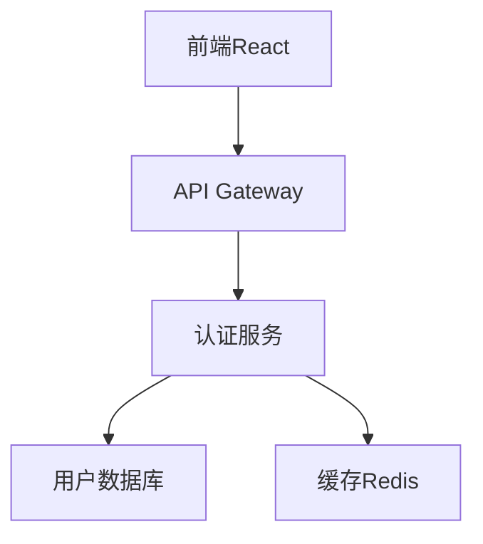

# 核心工作流程 - 文档先行与测试驱动的开发实践

> 状态：已完成
> 分类：开发流程
> 更新时间：2025-01-19

## 概述

在 AI 时代，软件工程的本质回归到了**知识工程**——软件是知识的实践和传递。现在 AI 写代码几乎毫不费力，人类的核心价值在于**定义需求**和**质量把关**。因此，**文档先行**和**测试先行**成为了最重要的工作流程。

## 核心理念

### 软件工程 = 知识工程

借用 ThoughtWorks 徐昊的观点：

> 软件工程本质上是知识工程，软件是知识的实践和传递。

在 AI 协作的背景下，这个观点更加凸显：
- **人类**：负责知识的定义、整理和验证
- **AI**：负责知识的实现和编码转化
- **协作**：通过文档和测试进行知识传递

### 为什么文档和测试先行？

1. **明确目标**：文档定义"要做什么"，测试定义"如何验证"
2. **降低沟通成本**：避免来回澄清需求
3. **AI 友好**：为 AI 提供清晰的实现目标
4. **质量保证**：预先定义验收标准

## 探索-计划工作流

### 第一阶段：探索阶段

在开始编码前，让 Claude 充分了解项目背景和业务需求。

#### 基础探索指令

```bash
# 1. 项目结构理解
"请先阅读项目的主要文件，不要立即开始编码"

# 2. 业务背景了解
"我们来讨论一下用户认证系统的需求，这里是背景资料：
- 用户类型：管理员、普通用户、访客
- 认证方式：邮箱+密码、第三方OAuth
- 安全要求：支持2FA、密码强度检查
"

# 3. 技术栈确认
"项目使用 Next.js + TypeScript + Prisma，请分析现有架构"
```

#### 深度探索技巧

使用不同的思考强度词汇来控制 AI 的分析深度：

```bash
# 轻度思考
"think 一下这个需求的实现方案"

# 中度思考  
"think more 关于用户权限系统的设计"

# 深度思考
"think harder 关于分布式系统中的一致性问题"

# 超深度思考
"ultrathink 这个架构决策的长远影响"
```

⚠️ **注意**：根据 [Claude Code 官方建议](https://www.anthropic.com/engineering/claude-code-best-practices)，不同词汇对应不同的思考预算：`"think" < "think hard" < "think harder" < "ultrathink"`

### 第二阶段：计划阶段

基于探索结果，制定详细的实现计划。

#### 计划生成模板

```bash
# 生成技术实现计划
"请制定一个实现用户认证功能的详细计划，使用 think harder 模式

计划应该包括：
1. 技术架构设计
2. 数据库表结构
3. API 接口设计
4. 安全策略
5. 测试策略
6. 部署方案

请将计划保存到 planning/auth-implementation.md"
```

#### 计划文档结构

```markdown
# 用户认证系统实现计划

## 1. 需求分析
### 功能需求
- [ ] 用户注册/登录
- [ ] 密码重置
- [ ] 第三方OAuth集成
- [ ] 二次认证(2FA)

### 非功能需求
- [ ] 性能：登录响应时间 < 200ms
- [ ] 安全：密码加密存储
- [ ] 可用性：99.9% uptime

## 2. 技术架构
### 系统组件


### 技术选型
- 前端：React + TypeScript
- 后端：Node.js + Express
- 数据库：PostgreSQL
- 认证：JWT + Refresh Token

## 3. 实现计划
### Phase 1: 基础认证
- Week 1: 数据库设计和用户模型
- Week 2: 注册和登录API
- Week 3: 前端界面实现

### Phase 2: 增强功能  
- Week 4: 密码重置功能
- Week 5: OAuth集成
- Week 6: 2FA实现

## 4. 测试策略
### 单元测试
- 用户模型测试
- 认证逻辑测试
- API端点测试

### 集成测试
- 认证流程测试
- 第三方服务集成测试

### E2E测试
- 用户注册流程
- 登录和注销流程
```

## 测试驱动开发（TDD）

### TDD 的 AI 优势

相比传统的"先写功能再写测试"，TDD 在 AI 协作中有显著优势：

1. **明确目标**：AI 有清晰的实现目标（让测试通过）
2. **验收标准**：测试即验收标准，便于用户验证
3. **重构安全**：有测试保护，重构更安全
4. **文档作用**：测试即活文档，展示如何使用

### TDD 实施框架

#### 标准 TDD Prompt

```bash
"我们正在进行测试驱动开发（TDD），请遵循以下规则：

1. **不要创建模拟实现**：即使对于还没有实现的功能也不要mock
2. **严格的红绿循环**：
   - RED：编写失败的测试
   - GREEN：写最少的代码让测试通过  
   - REFACTOR：在测试保护下重构代码
3. **不要修改测试**：测试是需求定义，不应该为了让代码通过而修改测试
4. **专注功能实现**：专注实现测试所定义的功能

现在请根据以下功能需求和预期输入输出编写测试：

功能：用户注册接口
输入：{ email: 'test@example.com', password: 'SecurePass123!' }
输出：{ success: true, userId: 'uuid', message: '注册成功' }

请开始编写测试，然后进入红绿循环。"
```

#### TDD 实践示例

**第一步：编写失败的测试**

```typescript
// tests/auth/register.test.ts
import { describe, it, expect } from 'vitest';
import { registerUser } from '../src/auth/register';

describe('用户注册', () => {
  it('应该成功注册新用户', async () => {
    const userData = {
      email: 'test@example.com',
      password: 'SecurePass123!'
    };

    const result = await registerUser(userData);

    expect(result).toEqual({
      success: true,
      userId: expect.any(String),
      message: '注册成功'
    });
  });

  it('应该拒绝重复的邮箱', async () => {
    const userData = {
      email: 'existing@example.com',
      password: 'SecurePass123!'
    };

    // 第一次注册
    await registerUser(userData);
    
    // 第二次注册应该失败
    const result = await registerUser(userData);
    
    expect(result).toEqual({
      success: false,
      error: '邮箱已存在'
    });
  });
});
```

**第二步：运行测试（RED）**

```bash
npm test -- register.test.ts
# 预期：测试失败，因为 registerUser 函数还不存在
```

**第三步：实现最小功能（GREEN）**

```typescript
// src/auth/register.ts
export async function registerUser(userData: {
  email: string;
  password: string;
}) {
  // 最简实现，让测试通过
  return {
    success: true,
    userId: 'temp-uuid',
    message: '注册成功'
  };
}
```

**第四步：逐步完善（REFACTOR）**

```typescript
// src/auth/register.ts
import { v4 as uuidv4 } from 'uuid';
import { hashPassword } from './password';
import { db } from '../database';

export async function registerUser(userData: {
  email: string;
  password: string;
}) {
  // 检查邮箱是否已存在
  const existingUser = await db.user.findUnique({
    where: { email: userData.email }
  });

  if (existingUser) {
    return {
      success: false,
      error: '邮箱已存在'
    };
  }

  // 创建新用户
  const hashedPassword = await hashPassword(userData.password);
  const userId = uuidv4();

  await db.user.create({
    data: {
      id: userId,
      email: userData.email,
      password: hashedPassword
    }
  });

  return {
    success: true,
    userId,
    message: '注册成功'
  };
}
```

### TDD 质量检查

为了避免测试过拟合，建议在所有测试通过后，启动一个独立的 Agent 进行检查：

```bash
# 新开一个 Claude 会话进行测试审查
"请审查以下测试代码，检查是否存在过拟合问题：

1. 测试是否真正验证了业务逻辑？
2. 测试是否过于依赖实现细节？
3. 是否存在测试遗漏的边界情况？
4. 测试的可维护性如何？

测试代码：[粘贴测试代码]
实现代码：[粘贴实现代码]"
```

## 文档驱动开发（DDD）

### API 文档先行

在实现 API 之前，先定义详细的 API 文档：

```yaml
# api-spec.yaml
openapi: 3.0.0
info:
  title: 用户认证 API
  version: 1.0.0

paths:
  /api/auth/register:
    post:
      summary: 用户注册
      requestBody:
        required: true
        content:
          application/json:
            schema:
              type: object
              required:
                - email
                - password
              properties:
                email:
                  type: string
                  format: email
                  example: "user@example.com"
                password:
                  type: string
                  minLength: 8
                  example: "SecurePass123!"
      responses:
        '200':
          description: 注册成功
          content:
            application/json:
              schema:
                type: object
                properties:
                  success:
                    type: boolean
                    example: true
                  userId:
                    type: string
                    example: "550e8400-e29b-41d4-a716-446655440000"
                  message:
                    type: string
                    example: "注册成功"
        '400':
          description: 请求参数错误
        '409':
          description: 邮箱已存在
```

### 架构决策记录（ADR）

对重要的技术决策进行记录：

```markdown
# ADR-001: 选择 JWT 作为认证方案

## 状态
已接受

## 背景
需要为用户认证系统选择一个token方案，主要候选方案：
1. Session + Cookie
2. JWT Token
3. OAuth 2.0

## 决策
选择 JWT Token 方案

## 理由
1. **无状态**：服务器不需要存储会话信息
2. **可扩展**：容易实现微服务架构
3. **移动友好**：适合移动应用
4. **标准化**：业界标准，工具支持完善

## 后果
### 优点
- 服务器无状态，容易水平扩展
- 跨域支持良好
- 可以包含用户信息，减少数据库查询

### 缺点
- Token 无法主动撤销（需要配合黑名单机制）
- Token 较大，每次请求都要传输
- 密钥管理复杂

## 实现细节
- 使用 RS256 算法签名
- Token 有效期设置为 15 分钟
- 配合 Refresh Token 实现长期登录
- 敏感操作需要重新验证
```

## 质量保证流程

### 代码审查清单

```markdown
## 功能完整性
- [ ] 实现了所有测试用例要求的功能
- [ ] 边界条件处理正确
- [ ] 错误处理充分

## 代码质量
- [ ] 代码结构清晰，易于理解
- [ ] 命名规范，语义明确  
- [ ] 没有重复代码
- [ ] 遵循项目代码规范

## 性能和安全
- [ ] 没有明显的性能问题
- [ ] 输入验证充分
- [ ] 没有安全漏洞
- [ ] 敏感信息处理正确

## 测试覆盖
- [ ] 单元测试覆盖率 > 80%
- [ ] 集成测试覆盖主要流程
- [ ] 测试用例包含异常情况

## 文档更新
- [ ] API 文档已更新
- [ ] README 更新（如需要）
- [ ] 代码注释清晰
```

### 持续集成检查

```yaml
# .github/workflows/quality-check.yml
name: 代码质量检查

on: [push, pull_request]

jobs:
  test:
    runs-on: ubuntu-latest
    steps:
      - uses: actions/checkout@v3
      - uses: actions/setup-node@v3
      
      - name: 安装依赖
        run: npm ci
        
      - name: 运行测试
        run: npm test -- --coverage
        
      - name: 类型检查
        run: npm run type-check
        
      - name: 代码规范检查
        run: npm run lint
        
      - name: 安全检查
        run: npm audit
        
      - name: 性能检查
        run: npm run lighthouse-ci
```

## 高级技巧

### 1. 需求分解技巧

```bash
# 使用 5W1H 方法分解需求
"请使用 5W1H 方法分析用户认证需求：
- What: 要实现什么功能？
- Why: 为什么需要这个功能？
- Who: 谁会使用这个功能？
- When: 什么时候会用到？
- Where: 在哪些场景下使用？
- How: 如何实现这个功能？"
```

### 2. 用例驱动设计

```bash
# 基于用户故事设计功能
"基于以下用户故事设计认证系统：

作为一个新用户
我想要创建账户
以便我可以使用系统的个性化功能

验收标准：
- 我可以使用邮箱和密码注册
- 密码需要符合安全要求
- 注册成功后自动登录
- 注册失败时显示明确的错误信息"
```

### 3. 风险驱动测试

```bash
# 识别高风险区域并重点测试
"识别用户认证系统的高风险区域：
1. 密码安全存储
2. 会话管理
3. 权限验证
4. 数据泄露防护

请为这些高风险区域设计专门的测试用例。"
```

---

*通过文档先行和测试驱动的方法，我们可以确保 AI 协作开发的质量和效率，让软件开发回归到知识工程的本质。*