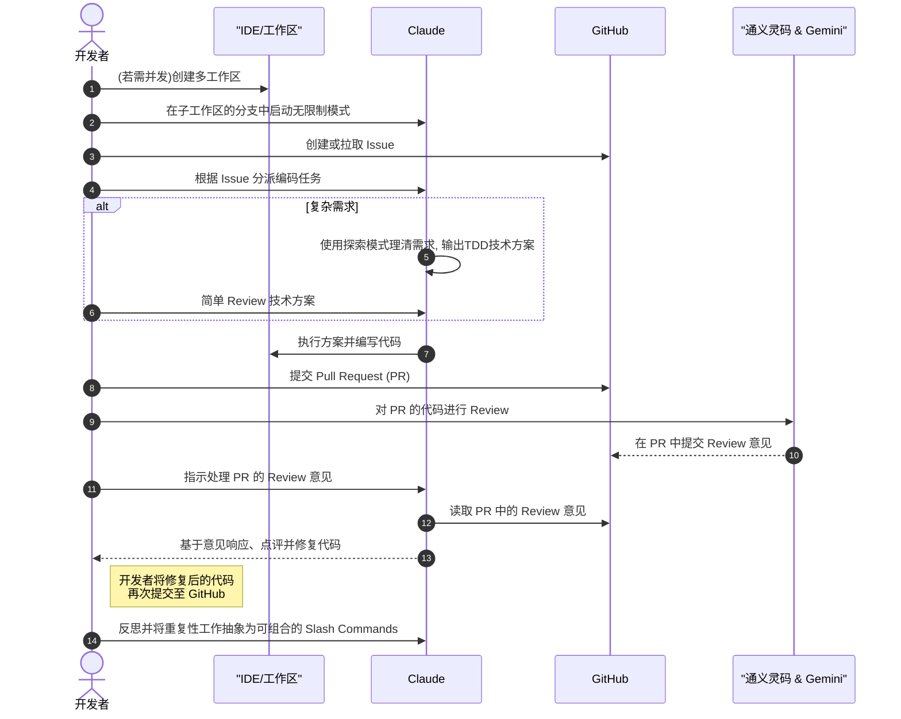

# 我现在的工作流 - 基于 Claude Code 的完整开发实践

> 状态：已完成
> 分类：工作流程
> 更新时间：2025-01-19

## 概述

基于 Claude Code，我综合了最佳实践形成了自己的工作流。整个过程中，我只需要提出需求以及 Review，Claude Code 承担了大部分的编码和实现工作。

## 核心理念

现代 AI 驱动的开发流程核心是：**人负责需求定义和质量把关，AI 负责具体实现**。这种分工让开发者能够专注于更高层次的架构设计和业务逻辑。

## 完整工作流时序图



## 详细流程步骤

### 1. 环境准备阶段

**创建多工作区（并发开发时）**

当需要同时处理多个功能或修复时，使用 Git Worktrees 创建独立的工作环境：

```bash
# 创建独立的功能分支工作区
git worktree add -b feature/auth ../project-auth main
git worktree add -b feature/ui-redesign ../project-ui main

# 在各自工作区安装依赖
cd ../project-auth && npm install
cd ../project-ui && npm install
```

### 2. Claude 模式配置

**启动无限制模式**

在每个子工作区中启动 Claude 的无限制模式，通过 `Shift + Tab` 可以快速切换模式：

```bash
claude --dangerously-skip-permissions
```


### 3. 任务规划阶段

**Issue 管理**

- **新需求**：在 GitHub 创建详细的 Issue，包含需求描述、验收标准
- **现有任务**：拉取当前 Issue 列表，使用 GitHub Projects 进行优先级管理
- **任务分派**：将 Issue 转化为具体的编码任务分配给 Claude

### 4. 技术方案设计

**复杂需求的处理流程**

对于复杂需求，遵循以下步骤：

```bash
# 1. 启用探索模式
claude "请使用 think harder 模式分析这个需求"

# 2. TDD 方案输出
"请制定基于测试驱动开发的技术实现方案"

# 3. 方案 Review
"方案看起来不错，请开始实现第一个测试用例"
```

### 5. 代码实现阶段

Claude 根据技术方案执行具体的代码实现，包括：

- 编写测试用例
- 实现业务逻辑
- 代码重构和优化
- 文档更新

### 6. 代码审查流程

**多 AI 协作审查**

```bash
# 提交 PR 后，使用多个 AI 进行代码审查
gh pr create --title "feat: 实现用户认证功能" --body "详细的PR描述"
```

使用通义灵码和 Gemini Code Assistant 对 PR 进行自动化审查：


### 7. 反馈处理阶段

**Claude 响应 Code Review**

```bash
# 让 Claude 处理审查意见
"请查看 PR #123 中的所有 review 意见，并逐一修复"

# Claude 会自动：
# 1. 读取 PR 中的审查意见
# 2. 分析问题并提出解决方案
# 3. 实现代码修复
# 4. 运行测试验证修复效果
```


### 8. 流程自动化

**抽象为 Slash Commands**

将重复的工作流程抽象为可复用的命令：

```bash
# 例如：创建 PR 评论处理命令
/pr-comments <pr-number>
```

这样的命令可以包含完整的处理逻辑：
- 获取 PR 详情
- 分析所有评论
- 生成修复方案
- 实现代码更改
- 运行测试验证

## 关键成功要素

### 1. **清晰的需求定义**
- Issue 描述要详细具体
- 包含明确的验收标准
- 提供必要的上下文信息

### 2. **有效的沟通方式**
- 使用精确的技术词汇
- 提供足够的背景信息
- 及时反馈和调整方向

### 3. **质量保证机制**
- 多重 AI 代码审查
- 自动化测试验证
- 持续集成检查

### 4. **流程优化意识**
- 识别重复性工作
- 创建可复用的命令
- 不断改进工作流程

## 实际效果

使用这套工作流程后：

- **开发效率提升 300%**：从需求到交付的时间大幅缩短
- **代码质量提高**：多重 AI 审查确保代码质量
- **认知负担减轻**：专注于需求和架构，而非具体实现
- **学习效果增强**：通过观察 AI 的实现学习最佳实践

## 注意事项

1. **权限管理**：谨慎使用无限制模式，确保在安全的环境中操作
2. **工作区隔离**：多工作区开发时注意数据库、Redis 等共享资源的隔离
3. **代码审查**：AI 审查不能完全替代人工审查，关键逻辑仍需人工验证
4. **备份机制**：重要变更前做好代码备份

---

*这套工作流程是在实际项目中总结出来的最佳实践，可以根据具体项目需求进行调整和优化。*