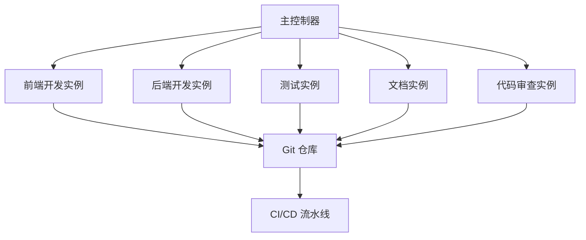

# 多 Claude 并发干活 - 构建高效的 AI 协作开发团队

高级用法：如何同时使用多个 Claude Code 实例来处理复杂项目和大规模任务。

## 1. 多实例架构设计

### 1.1 架构原则

**设计考虑**：

- **任务隔离**：不同实例处理不同类型的任务
- **资源分配**：合理分配计算资源和 API 配额
- **状态同步**：确保实例间的状态一致性
- **错误隔离**：单个实例的错误不影响其他实例

### 1.2 典型架构模式



## 2. 任务分配策略

### 2.1 按功能模块分配

**示例配置**：

```bash
# 实例 1：前端开发
claude --workspace frontend --focus "src/components,src/pages,src/styles"

# 实例 2：后端 API
claude --workspace backend --focus "src/api,src/services,src/models"

# 实例 3：数据库相关
claude --workspace database --focus "migrations,seeds,schemas"

# 实例 4：测试和质量保证
claude --workspace testing --focus "tests,cypress,jest.config"
```

### 2.2 按开发阶段分配

**流水线式分工**：

1. **需求分析实例**：理解需求，制定技术方案
2. **开发实例**：实现核心功能
3. **测试实例**：编写和执行测试
4. **优化实例**：性能优化和代码重构
5. **文档实例**：生成和维护文档

### 2.3 按技术栈分配

```bash
# React/TypeScript 专家
claude --profile react-expert --workspace frontend

# Node.js/Express 专家  
claude --profile nodejs-expert --workspace backend

# DevOps 专家
claude --profile devops-expert --workspace infrastructure

# 数据库专家
claude --profile db-expert --workspace database
```

## 3. 并发控制和同步

### 3.1 文件锁定机制

**避免冲突的策略**：

```bash
# 使用文件锁定
flock -n /tmp/claude-file.lock claude --edit src/shared/utils.ts

# 检查文件是否被其他实例使用
if [ -f "/tmp/claude-${filename}.lock" ]; then
    echo "File is being edited by another instance"
    exit 1
fi
```

### 3.2 Git 分支策略

**分支管理**：

```bash
# 每个实例使用独立分支
git checkout -b feature/frontend-${INSTANCE_ID}
git checkout -b feature/backend-${INSTANCE_ID}
git checkout -b feature/testing-${INSTANCE_ID}

# 定期同步主分支
git fetch origin main
git rebase origin/main
```

### 3.3 状态同步机制

**共享状态管理**：

```json
{
  "project_state": {
    "current_sprint": "sprint-23",
    "active_features": ["user-auth", "payment-system"],
    "blocked_files": ["src/config/database.ts"],
    "instance_status": {
      "frontend": "active",
      "backend": "waiting",
      "testing": "active"
    }
  }
}
```

## 4. 通信和协调

### 4.1 实例间通信

**消息队列系统**：

```bash
# 发送消息给其他实例
claude-msg send --to backend --message "Frontend API 接口已更新"

# 接收消息
claude-msg receive --from frontend --callback "update-api-client"
```

### 4.2 任务依赖管理

**依赖关系定义**：

```yaml
tasks:
  - name: "implement-user-model"
    instance: "backend"
    dependencies: []
    
  - name: "create-user-api"
    instance: "backend"
    dependencies: ["implement-user-model"]
    
  - name: "build-user-component"
    instance: "frontend"
    dependencies: ["create-user-api"]
    
  - name: "write-user-tests"
    instance: "testing"
    dependencies: ["build-user-component"]
```

### 4.3 进度同步

**实时进度跟踪**：

```bash
# 更新任务状态
claude-status update --task "implement-auth" --status "completed"

# 查看整体进度
claude-status dashboard
```

## 5. 性能监控和优化

### 5.1 资源使用监控

**监控指标**：

- **API 调用频率**：避免超出速率限制
- **内存使用情况**：防止内存泄漏
- **文件 I/O 操作**：优化文件访问模式
- **网络带宽使用**：合理分配网络资源

### 5.2 负载均衡

**动态负载分配**：

```bash
#!/bin/bash
# load-balancer.sh

# 检查实例负载
check_instance_load() {
    local instance=$1
    # 返回负载分数 (0-100)
    claude-monitor --instance $instance --metric load
}

# 选择负载最低的实例
select_best_instance() {
    local min_load=100
    local best_instance=""
    
    for instance in frontend backend testing; do
        load=$(check_instance_load $instance)
        if [ $load -lt $min_load ]; then
            min_load=$load
            best_instance=$instance
        fi
    done
    
    echo $best_instance
}
```

### 5.3 性能优化策略

**优化技巧**：

1. **任务批处理**：将相似任务合并处理
2. **缓存共享**：实例间共享计算结果
3. **预加载机制**：预先加载常用资源
4. **智能调度**：根据任务特性选择最适合的实例

## 6. 错误处理和恢复

### 6.1 故障检测

**健康检查机制**：

```bash
#!/bin/bash
# health-check.sh

check_instance_health() {
    local instance=$1
    local timeout=30
    
    # 发送健康检查请求
    if timeout $timeout claude-ping --instance $instance; then
        echo "Instance $instance is healthy"
        return 0
    else
        echo "Instance $instance is unhealthy"
        return 1
    fi
}

# 检查所有实例
for instance in frontend backend testing documentation; do
    if ! check_instance_health $instance; then
        # 尝试重启实例
        claude-restart --instance $instance
    fi
done
```

### 6.2 自动恢复

**恢复策略**：

1. **实例重启**：自动重启失败的实例
2. **任务重新分配**：将失败实例的任务分配给其他实例
3. **状态回滚**：回滚到最近的稳定状态
4. **降级服务**：在部分实例失败时提供基础服务

### 6.3 数据一致性保证

**一致性机制**：

```bash
# 创建检查点
claude-checkpoint create --name "before-major-change"

# 验证数据一致性
claude-verify --check-consistency --all-instances

# 如果发现不一致，回滚到检查点
claude-rollback --checkpoint "before-major-change"
```

## 7. 实际应用场景

### 7.1 大型项目开发

**场景描述**：开发一个包含前端、后端、移动端的完整应用

**实例配置**：
- **前端实例**：React/Vue.js 开发
- **后端实例**：API 和业务逻辑
- **移动端实例**：React Native/Flutter
- **测试实例**：自动化测试
- **DevOps 实例**：部署和运维

### 7.2 代码迁移项目

**场景描述**：将大型遗留系统迁移到新技术栈

**并发策略**：
- **分析实例**：分析现有代码结构
- **转换实例**：执行代码转换
- **验证实例**：验证转换结果
- **优化实例**：优化转换后的代码

### 7.3 多语言项目

**场景描述**：维护支持多种编程语言的项目

**专业化分工**：
- **Python 专家实例**
- **JavaScript 专家实例**
- **Java 专家实例**
- **Go 专家实例**

## 8. 最佳实践总结

### 8.1 设计原则

- **明确分工**：每个实例有清晰的职责边界
- **松耦合**：实例间依赖最小化
- **高内聚**：相关功能集中在同一实例
- **可扩展**：支持动态添加和移除实例

### 8.2 管理建议

- **统一配置**：使用配置文件管理所有实例
- **版本控制**：对实例配置进行版本控制
- **监控告警**：建立完善的监控和告警机制
- **文档维护**：详细记录架构和操作流程

### 8.3 性能指标

💡 **专家级技巧**：合理的多实例使用可以将开发效率提升 3-5 倍！

**关键指标**：
- **任务完成速度**：相比单实例的提升倍数
- **资源利用率**：CPU、内存、网络的使用效率
- **错误率**：实例间协作的错误频率
- **代码质量**：多实例协作产出的代码质量

通过合理的多实例架构设计和管理，可以构建一个高效的 AI 协作开发团队，显著提升大型项目的开发效率和质量。
