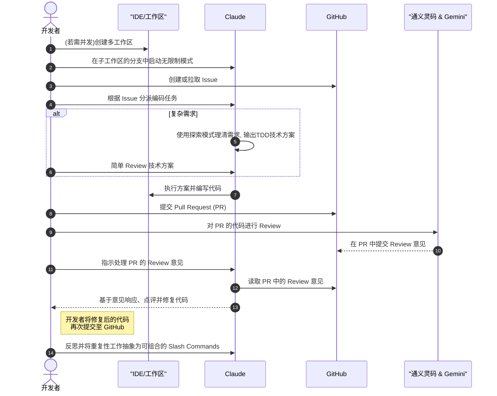

# 我现在的工作流

基于 Claude Code，我综合了最佳实践形成了自己的工作流如下，整个过程其实我只需要提出需求以及Review。

## 时序图

## 流程细节

1. **多工作区管理**：有需要并发则创建多工作区（其实更好的方法是多买两个💻：）
2. **无限制模式**：在子工作区中每个分支启动 Claude 无限制模式，通过 `Shift Tab` 需要时切换模式
3. **Issue 管理**：对于新需求创建 issue，或者拉取当前 issue。多个 issue 可以使用 GitHub Projects 管理
4. **任务分派**：按照 issue 给 Claude Code 派活。对于复杂需求，使用探索模式理清需求，尽量产出基于 TDD 的技术方案
5. **代码审查**：提交 PR 后，使用通义灵码和 Gemini Code Assistant Review PR 代码
6. **响应反馈**：Claude 响应 Code Review 意见，点评后修复
7. **抽象命令**：对每一个重复的工作都可以抽象成 commands，注意 commands 不要太大，方便组合

## 核心优势

- **效率提升**：开发者只需要提出需求和 Review，大大提升开发效率
- **质量保证**：多重 AI 代码审查确保代码质量
- **流程标准化**：标准化的工作流程减少人为错误
- **可复用性**：重复工作抽象为命令，提高复用性

## 最佳实践

- 始终保持代码审查的习惯
- 使用 TDD 方法确保代码质量
- 定期更新项目记忆库
- 合理使用 MCP 服务器扩展功能
